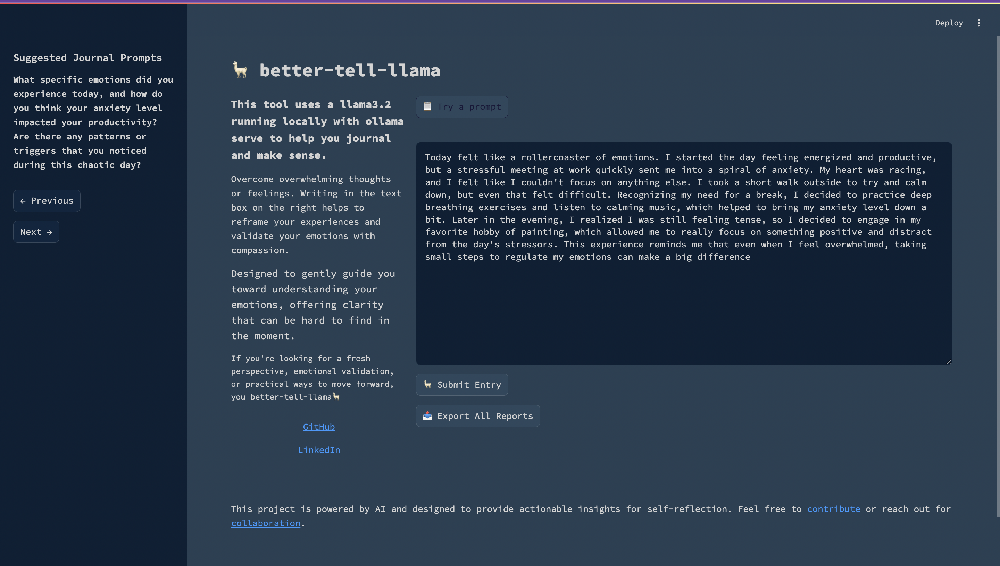

# Diverge

Diverge is a journaling tool designed specifically for neurodivergent individuals to help with emotional regulation. By focusing on simplicity and clarity, Diverge provides users with a streamlined way to process and reflect on their mental states, experiences, and tasks without feeling overwhelmed.

## Screenshots



## Features
- **Emotional Regulation**: Identifies complex emotions, causes, and triggers expressed in the entry, providing opportunities for effective cognitive reappraisal.
- **Personalized Prompts**: Generates journaling prompts for users, based on their three most recent entries.
- **Export Entries and Reports**: All entries and their reports are persisted locally. User can export all entries + reports to date into a CSV. 
- **Streamlined Input and Output**: Avoids excessive outputs and complexity, ensuring users receive actionable insights without additional cognitive burden.
- **AI-Powered Analysis**: Powered by a Llama 3.2 7b, running locally on Ollama, to ensure privacy and responsiveness. Free of cost and not part of the daily LLM carbon footprint (ChatGPT emits approx. 43,200 kilograms of CO2 each day)
- **Minimalist Frontend**: Built with Streamlit, providing a clean and intuitive interface.

## How It Works
1. **Input**: Users write candid journal entries about their thoughts, feelings, or experiences.
2. **Processing**: The Llama 3.2 model processes the input, identifies emotions, contexts and triggers, along with opportunities for effective cognitive reappraisal.
3. **Output**: The user receives feedback that emphasizes emotional clarity and self-compassion, helping them better understand their mental states.

## Why Diverge?
Diverge is built with the needs of neurodivergent individuals in mind, offering:
- A non-judgmental space for self-expression.
- Tools to foster emotional clarity and understanding.
- A focus on self-compassion over performance or productivity.

## Technologies Used
- **Backend**: fastAPI and python3.11.
- **Frontend**: Streamlit for an interactive and accessible user interface.
- **Local LLM**: Ensures privacy and data security by processing everything locally.
- **Local DB**: sqlite 

## Installation
To run Diverge on your local machine, follow these steps:

1. **Clone the Repository**:
   ```bash
   git clone https://github.com/yourusername/diverge.git
   cd diverge
   ```

2. **Set Up the Environment**:
   Ensure you have Python installed (version 3.8 or higher) and set up a virtual environment:
   ```bash
   python -m venv venv
   source venv/bin/activate  # On Windows: venv\Scripts\activate
   ```

3. **Install Dependencies**:
   Install the required Python packages:
   ```bash
   pip install -r requirements.txt
   ```

4. **Start Ollama**:
   Install Ollama and start Llama 3.2.

5.  **Launch Diverge in your browser**:
   ```bash
   python diverge.py
   ```
   
6. **Access the Application**:
   If browser does not open, navigate to `http://localhost:8501` to start using Diverge.

## Contributing
Contributions are welcome. Journaling is one way to practice emotional regulation with local llms. If you have ideas for features or want to improve the existing code, please submit a pull request or open an issue in the repository.

## License
Diverge is licensed under the MIT License. See `LICENSE` for more details.

---

### Contact
For questions or support, please reach out to [mukutm2@illinois.edu] or open an issue in this repository.

